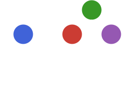

# PointProcesses.jl

> This package is not actively maintained, but if you would like to contribute or take over, feel free to reach out!

A package for temporal point process modeling, simulation and inference.

See the [documentation](https://gdalle.github.io/PointProcesses.jl/stable) for more details.
